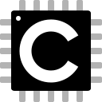

  

<h1 align="center">Kyle Kovalchick</h1>

  <b>Embedded Systems & Flight Avionics</b> — Rust • C/C++ • Python • FPGA/ASIC test • HIL
   
  <a href="mailto:kovalchickzz@gmail.com">Email</a> ·
  <a href="https://www.linkedin.com/in/kyle-kovalchick">LinkedIn</a>

---

### 🚀 What I’m about
- Systems that **touch real hardware**: flight computers, telemetry, side-channel-aware crypto test rigs, custom tooling for silicon bring-up.
- I value **clarity over cleverness**, predictable timing, and strong observability (logs, metrics, traces).
- Currently: flight-computer R&D, ASIC validation automation, and a power-network simulator for shipboard grids.

### 🧩 Highlights
- **Flight Computer (personal rocketry)** — STM32-class MCU, Rust firmware, FRAM logging, watchdogs, and hardware-in-the-loop tests.
- **ASIC/FPGA Test** — Python/Rust harnesses for vectors, sweep campaigns, and results diffing; reproducible benches & artifacts.
- **Power Network Sim** — Fast nodal solve, breakers/bus ties, generator swing dynamics, frequency droop, UI telemetry.

---

### 🛠️ Tech Stack (selection)

  <!-- Languages / Core -->
  
  
  
  
  
  

  <!-- Platforms / Tooling -->
  
  
  
  
  
  

  <!-- HW-adjacent / Maker -->
  
  

  <!-- Editors -->
  
  

  
<b>More tools I use</b>

  

    Kubernetes · Nix/NixOS · CMake · OpenCV · NumPy · PyTorch · TailwindCSS · FastAPI · Redis · PostgreSQL
  

---

### 📦 Selected Projects

- **Project Zenith — Two-Stage Flight Computer**
  - Rust firmware (async tasks), sensor fusion (EKF), event recorder, brownout-safe logging.
  - HIL with scripted fault injection; ground-station link for live telemetry.

- **Generator & Bus Network Simulator**
  - Swing equation, AVR/gov with droop, breaker topology changes, fast nodal admittance solve.
  - Real-time UI probes for |V|/θ, P/Q, ω, and protection events.

- **ASIC/FPGA Test Harnesses**
  - Vector campaign runner (Rust/Python), reproducible artifacts, dashboards in Grafana/Prometheus.

> If you’re building avionics, embedded test rigs, or power sims, I’m open to collaborating.

---

### 📈 GitHub Stats (optional—collapse if you prefer clean)

  
Show activity cards

   
  

    
    
  

  

    
  

---

  

